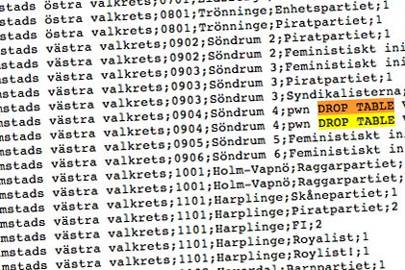
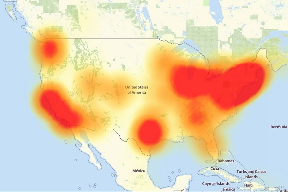
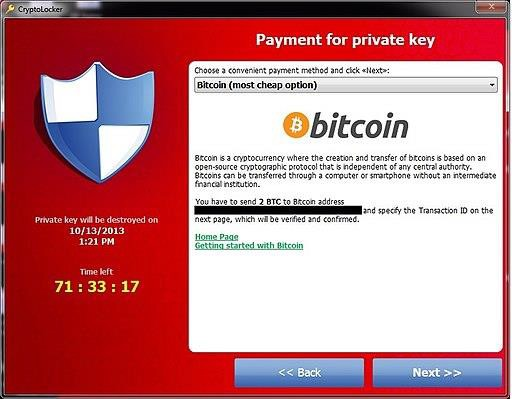

Discussing the C-I-A Triad
==========================

Information security is a broad topic; many aspects range in their technical
depth. Whether you consider information security from a managerial perspective
or from a very technical perspective, understanding Confidentiality, Integrity
and Availability (C-I-A) is crucial. Effective information security must take
into account an organization’s business goals and needs. By relating these to
the C-I-A triad, one can best understand how to assess risks, prioritize
controls and produce/enforce policies that ensure compliance with applicable law
or regulation.

Definitions for these terms and related vocabulary can be found in "NIST Special
Publication 800-12, *An Introduction to Information Security".* This publication
is available free of charge from: *https://doi.org/10.6028/NIST.SP.800-12r1.*
Additionally, Federal Code 44 U.S.C., Sec. 3542 provides definitions of these
(and other) terms.

The following are the definitions can be found in the NIST SP 800-12, page 2,
para. 1.4. These definitions serve as the basis for the concepts but may be
worded slightly different in other publications.

-   **Confidentiality**: Preserving authorized restrictions on information
    access and disclosure, including means for protecting personal privacy and
    proprietary information.

-   **Integrity:** Guarding against improper information modification or
    destruction and ensuring information non-repudiation and authenticity.

-   **Availability:** Ensuring timely and reliable access to and use of
    information.

*Additionally, as we discuss the C-I-A triad and move into information security
governance and risk management, it will be important to understand
non-repudiation, principles of A.A.A, and security controls. The following are
brief explanations for these topics. They will be discussed in greater depth as
they relate to information security throughout the course.*

-   **Non-repudiation:** This deals with creating evidence to prove certain
    facts or actions. Specifically, proving something has taken place that can’t
    be repudiated later; an example may be asserting authenticity and
    attribution of digital correspondence (email) through a digital signature.
    The digital signature both ensures data integrity and guarantees the
    sender’s identity.

-   **Authentication, Authorization, Accountability (AAA):** These three terms
    cover the mechanisms used for controlling the access to
    information/resources, controlling the level of privilege or permissions
    granted to those accessing the information/resources, and auditing usage of
    said information/resources.

-   **Security Controls**: This refers to the management, operational, and
    technical controls (safeguards or countermeasures) which are prescribed to
    protect the confidentiality, availability, and integrity of the system and
    its information.

To fully apply these concepts as they relate to information security, we will
need to take a look at examples of how they may be compromised and the
consequences to business operations.

Confidentiality
---------------

*Confidentiality of data is distinctly important when information requires
access limitations*

The need for confidentiality may be due to a law or regulation such as with
Personal Identifiable Information (PII) or data governed by the Health Insurance
Portability and Accountability Act (HIPAA). Alternatively, the need may be tied
to protecting intellectual property from theft. Maybe the need is required
because the information contains credit card numbers that must be protected to
avoid fraud or identity theft. Whatever the reason, there are many
considerations when protecting the confidentiality of information.

Controlling access to information is a component in ensuring confidentiality.
This can be done from a physical or logical perspective. From a physical
perspective, controlling access to a data center by issuing keys to only
authorized personnel provides control. Controlling access for logical resources
like information systems on the other hand entails measures to authenticate
users (prove who they are) and provide appropriate authorizations (what they can
do to/with information.)

*Even the best access control methods can be subverted; in case of unauthorized
access, additional mechanisms must be in place to for protecting information.*

-   **Cryptography-** This involves the process of using mathematics
    (algorithms) to transform information and obfuscate the content. This
    operation, known as **encryption**, is performed by a sender (or keeper) of
    data. The recipient or entity accessing the data uses decryption, based on
    having the proper "key", to transform the data back to its original form.
    While governance specific to the type of information being considered
    dictates the use of cryptography, NIST has authored a number of publications
    to provide guidance regarding how cryptographic protection is to be
    implemented.

When securing the confidentiality of data, both “at-rest” and “in-transit”
states must be considered. Encryption should be used on all sensitive
information, whenever possible. Encryption provides a mechanism for making the
information unusable to anyone that does not possess the “key” to decrypt, or
“unlock” the data. Obviously encrypting a database that contains sensitive
information is important, but how about the data in- transit that is being
sent/uploaded to the database? The network media that transports the data must
have protections in place as well.

The Payment Card Industry Data Security Standard (PCI-DSS) for example, requires
encryption of data including credit card information while stored and
in-transit. When this standard is not aggressively implemented, the consequences
can be monumental. Over 40 million credit card numbers were stolen due to the
Target breach in 2013.

Those credit card numbers were captured from the volatile memory of the
Point-of- Sales (POS) terminals and were exfiltrated. Had these numbers been
encrypted by hardware as they we captured by the POS terminals (in-transit), the
confidentiality of the data would have been successfully maintained. [2]

More information regarding legislative mandates and executive directives for the
use of cryptography can be found in NIST Special Publication
800-175A,*"Guideline for Using Cryptographic Standards in the Federal
Government: Directives, Mandates and Policies".*This publication is available
free of charge from: <http://dx.doi.org/10.6028/NIST.SP.800-175A>.

More information regarding specific use of cryptographic mechanisms can be found
in NIST Special Publication 800-175B, *"Guideline for Using Cryptographic
Standards in the Federal Government: Cryptographic Mechanisms".*This publication
is available free of charge from:
[http://dx.doi.org/10.6028/NIST.SP.800-175B.](http://dx.doi.org/10.6028/NIST.SP.800-175B)

### Examples in Confidentiality:

The history of encryption keys goes back to the early 1970's. The National
Bureau of Standards (now known as NIST), published a call for proposals to
create a publicly available encryption standard. A standard proposed by IBM, and
modified by the National Security Agency (NSA) was selected and DES was born. At
the time, DES seemed to be a highly secure standard. Since DES is based on a
56-bit key, there are 256 (72,057,594,037,927,936) possibilities. In the 1970's,
the computational power did not support the idea of this being achieved within a
human’s lifetime, therefore DES was considered unbreakable. Fast forward a
couple decades and this was no longer the case. In 1997, a group of individuals
successfully cracked the DES algorithm. This challenge, proposed by RSA, proved
that as computational power increases, shorter encryption key lengths are
subject to being broken through the use of brute-force attacks.

While DES was originally published in FIPS 46, July of 1977, its last
reaffirmation by NIST was in FIPS 46-3, which specifies the preferred use of
Triple DES, with single DES being permitted only in legacy systems. Today,
AES-256 has become the gold standard in symmetric encryption.

Integrity
---------

*Integrity is very important as a measure of trust in information*

Financial transactions clearly illustrate the need for accuracy and consistency
in information. For a banking or e-commerce type of business, it is critical
that information be accurate. Much like with confidentiality, this principle
applies to both the integrity of information contained in transactions, as well
as the integrity of the data-at-rest. If a bank could not give customers an
accurate account balance, the business and liability implications would be
tremendous.

Although malware, hacking and other intentional malicious activity can threaten
information integrity, the threat to information integrity may also come for
sources that are less intentional. Human error or errors due to
misconfigurations can threaten the integrity of information as well.

-   **Input Validation-** This is important to ensuring integrity by validating
    the data that is entered into a system meets the intended parameters for the
    data and no code injection techniques can impact stored data.

-   **Hashing-** This offers integrity for data by using a one-way operation to
    create a "fingerprint" which can be used to verify no alternations to the
    data have been made. The principle behind a hash is that for any unique
    input, there should be a unique output (hash value) and is produced however
    the original value cannot be determined or reversed from the hash value
    (whereas encryption/decryption is a two-way function) A strong hashing
    algorithm should be collision resistant. SHA and MD5 are both common hashing
    standards; however both MD5 and the SHA-1 family are obsolete/not recommend
    for use. SHA-2/3 family functions increase the digest (hash) value and are
    considered safe and collision resistant.

-   **Digital Signature-** This operation is used to both ensure that there is
    no alteration in the message and that the sender of the message can be
    positively attributed.

-   **Auditing-** Keeping an audit trail allows an organization to maintain
    oversight on what is happening to information. This is important to
    reinforcing the aspect of “accounting” in the AAA model. Some key attributes
    of audit logs are that they should be automated, have access restrictions in
    place to prevent tampering, include all events (create/delete/read/modify),
    and record a user and timestamp for events.

### Examples in Integrity:

Apparently, even paper ballots are subject to hacking attempts. In 2010, during
a Swedish election, several suspicious write-in entries were discovered on paper
based ballots. While it is unknown who cast the ballots, there were attempts at
SQL code injection meant to delete all the information in the table as well as
several attempts to get JavaScript based information (website listings) into the
results. The attempt was not successful in causing any data loss or manipulation
however had conditions aligned differently, there was potential for embarrassing
and disruptive consequences.

Availability
------------

*Availability is a concern when information must be provided or accessible*

Availability is needed in situations where information is required/provided for
consumption such as with things like airport ticketing systems, GPS systems, or
any type of business facilitating system that can affect operations when
unavailable. Some assets that provide availability to information and
information systems might include physical assets such as switches that connect
users. Other assets may be software in nature or a service that enables
operations. Without DNS for example, users may not be able to browse the
internet. This sounds like a trivial problem, but in October of 2016, the Mirai
botnet was used to launch a Distributed Denial of Service (DDoS) attack again
Dyn. Dyn provides DNS services for much of the United States, specifically on
the east coast; this DDoS stopped users in affected areas from reaching Netflix,
Amazon, Twitter and Paypal just to name a few, for the entire day.

Another common example of a human threat of availability is ransomware.
Ransomware attacks have been on the rise and this represents a means for
exploiting a denial of availability to extort money from the victim(s). In these
cases, the attacker generally demands payment to restore availability of date
that has been encrypted by a key that the attacker holds. Regular backups and
other high-availability mechanisms are helpful in maintaining availability of
data in the event of an incident that threatens access.

Being able to use information as anticipated does not always constitute a
security breach or incident however it can. It is worth remembering that not all
threats to the C-I- A attributes are deliberate. A natural disaster impact
availability by the same measure

as an attacker deploying a Denial-of-Service (DoS) attack. By realizing that
loss of availability may come from a range of sources, we can better understand
all the types

.exe extension type that indicates an executable program, rather than a PDF
document.

Once run, the Trojan used RSA public key encryption to encrypt user files and
demanded payment for decryption keys.
