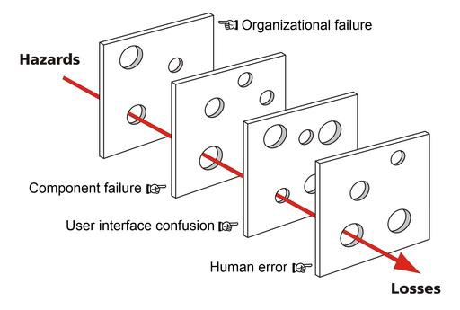

Discussing the C-I-A Triad
==========================

>   Information security is a broad topic; many aspects range in their technical
>   depth. Whether you consider information security from a managerial
>   perspective or from a very technical perspective, understanding
>   Confidentiality, Integrity and Availability (C-I-A) is crucial. Effective
>   information security must take into account an organization’s business goals
>   and needs. By relating these to the C-I-A triad, one can best understand how
>   to assess risks, prioritize controls and produce/enforce policies that
>   ensure compliance with applicable law or regulation.

>   Definitions for these terms and related vocabulary can be found in "NIST
>   Special Publication 800-12, *An Introduction to Information Security".* This
>   publication is available free of charge from:
>   *https://doi.org/10.6028/NIST.SP.800-*

>   *12r1.* Additionally, Federal Code 44 U.S.C., Sec. 3542 provides definitions
>   of these (and other) terms.

>   The following are the definitions can be found in the NIST SP 800-12, page
>   2, para. 1.4. These definitions serve as the basis for the concepts but may
>   be worded slightly different in other publications.

>   **Confidentiality**: Preserving authorized restrictions on information
>   access and disclosure, including means for protecting personal privacy and
>   proprietary information.

>   **Integrity:** Guarding against improper information modification or
>   destruction and ensuring information non-repudiation and authenticity.

>   **Availability:** Ensuring timely and reliable access to and use of
>   information.

>   *Additionally, as we discuss the C-I-A triad and move into information
>   security governance and risk management, it will be important to understand
>   non-repudiation, principles of A.A.A, and security controls. The following
>   are brief explanations for these topics. They will be discussed in greater
>   depth as they relate to information security throughout the course.*

>   **Non-repudiation:** This deals with creating evidence to prove certain
>   facts or actions. Specifically, proving something has taken place that can’t
>   be repudiated later; an example may be asserting authenticity and
>   attribution of digital correspondence (email) through a digital signature.
>   The digital signature both ensures data integrity and guarantees the
>   sender’s identity.

>   **Authentication, Authorization, Accountability (AAA):** These three terms
>   cover the mechanisms used for controlling the access to
>   information/resources, controlling the level of privilege or permissions
>   granted to those accessing the information/resources, and auditing usage of
>   said information/resources.

>   **Security Controls**: This refers to the management, operational, and
>   technical controls (safeguards or countermeasures) which are prescribed to
>   protect the confidentiality, availability, and integrity of the system and
>   its information.

>   To fully apply these concepts as they relate to information security, we
>   will need to take a look at examples of how they may be compromised and the
>   consequences to business operations.

Confidentiality
---------------

>   *Confidentiality of data is distinctly important when information requires
>   access limitations*

>   The need for confidentiality may be due to a law or regulation such as with
>   Personal Identifiable Information (PII) or data governed by the Health
>   Insurance Portability and Accountability Act (HIPAA). Alternatively, the
>   need may be tied to protecting intellectual property from theft. Maybe the
>   need is required because the information contains credit card numbers that
>   must be protected to avoid fraud or identity theft. Whatever the reason,
>   there are many considerations when protecting the confidentiality of
>   information.

Controlling access to information is a component in ensuring confidentiality.
This can

>   be done from a physical or logical perspective. From a physical perspective,
>   controlling access to a data center by issuing keys to only authorized
>   personnel provides control. Controlling access for logical resources like
>   information systems on the other hand entails measures to authenticate users
>   (prove who they are) and provide appropriate authorizations (what they can
>   do to/with information.)

>   *Even the best access control methods can be subverted; in case of
>   unauthorized access, additional mechanisms must be in place to for
>   protecting information.*

>   **Cryptography-** This involves the process of using mathematics
>   (algorithms) to transform information and obfuscate the content. This
>   operation, known as **encryption**, is performed by a sender (or keeper) of
>   data. The recipient or entity accessing the data uses decryption, based on
>   having the proper "key", to transform the data back to its

>   original form. While governance specific to the type of information being
>   considered dictates the use of cryptography, NIST has authored a number of
>   publications to provide guidance regarding how cryptographic protection is
>   to be implemented.

>   When securing the confidentiality of data, both “at-rest” and “in-transit”
>   states must be considered. Encryption should be used on all sensitive
>   information, whenever possible. Encryption provides a mechanism for making
>   the information unusable to anyone that does not possess the “key” to
>   decrypt, or “unlock” the data. Obviously encrypting a database that contains
>   sensitive information is important, but how about the data in- transit that
>   is being sent/uploaded to the database? The network media that transports
>   the data must have protections in place as well.

>   The Payment Card Industry Data Security Standard (PCI-DSS) for example,
>   requires encryption of data including credit card information while stored
>   and in-transit. When this standard is not aggressively implemented, the
>   consequences can be monumental. Over 40 million credit card numbers were
>   stolen due to the Target breach in 2013.

>   Those credit card numbers were captured from the volatile memory of the
>   Point-of- Sales (POS) terminals and were exfiltrated. Had these numbers been
>   encrypted by hardware as they we captured by the POS terminals (in-transit),
>   the confidentiality of the data would have been successfully maintained. [2]

>   More information regarding legislative mandates and executive directives for
>   the use of cryptography can be found in NIST Special Publication
>   800-175A,*"Guideline for Using Cryptographic Standards in the Federal
>   Government: Directives, Mandates and Policies".*This publication is
>   available free of charge

>   from: <http://dx.doi.org/10.6028/NIST.SP.800-175A>.

>   More information regarding specific use of cryptographic mechanisms can be
>   found

>   in NIST Special Publication 800-175B, *"Guideline for Using Cryptographic
>   Standards in the Federal Government: Cryptographic Mechanisms".*This
>   publication is available free of charge from:
>   [http://dx.doi.org/10.6028/NIST.SP.800-175B.](http://dx.doi.org/10.6028/NIST.SP.800-175B)

>   **Examples:**

>   The history of encryption keys goes back to the early 1970's. The National
>   Bureau of Standards (now known as NIST), published a call for proposals to
>   create a publicly available encryption standard. A standard proposed by IBM,
>   and modified by the National Security Agency (NSA) was selected and DES was
>   born. At the time, DES seemed to be a highly secure standard. Since DES is
>   based on a 56-bit key, there are 256 (72,057,594,037,927,936) possibilities.
>   In the 1970's, the computational power did not support the idea of this
>   being achieved within a human’s lifetime, therefore DES was considered
>   unbreakable.[1]Fast forward a couple decades and this was no longer the
>   case. In 1997, a group of individuals successfully cracked the DES
>   algorithm. This challenge, proposed by RSA, proved that as computational
>   power increases, shorter encryption key lengths are subject to being broken
>   through the use of brute-force attacks. An archive of the work performed by
>   the group during this effort can be found at:
>   https://web.archive.org/web/20080725110701/<http://home.earthlink.net/~rcv007/desc>
>   hall.htm *(Links to an external site.)*

>   While DES was originally published in FIPS 46, July of 1977, its last
>   reaffirmation by NIST was in FIPS 46-3, which specifies the preferred use of
>   Triple DES, with single DES being permitted only in legacy systems. Today,
>   AES-256 has become the gold standard in symmetric encryption.

>   References

1.  *B. Shelton and C. Johnson, "A Brief History of Encryption," 19 July 2010.
    [Online]. Available:
    https://*[www.technewsworld.com/story/70437.html.](http://www.technewsworld.com/story/70437.html)
    *[Accessed 5 June 2018].*

2.  *T. Radichel, "SANS Institute InfoSec Reading Room," 5 August 2014.
    [Online]. Available:
    https://*[www.sans.org/reading-room/whitepapers/casestudies/case-study-](http://www.sans.org/reading-room/whitepapers/casestudies/case-study-)
    *critical-controls-prevented-target-breach-35412. [Accessed 27 June 2018].*

Integrity
---------

>   *Integrity is very important as a measure of trust in information*

>   Financial transactions clearly illustrate the need for accuracy and
>   consistency in information. For a banking or e-commerce type of business, it
>   is critical that information be accurate. Much like with confidentiality,
>   this principle applies to both the integrity of information contained in
>   transactions, as well as the integrity of the data-at-rest. If a bank could
>   not give customers an accurate account balance, the business and liability
>   implications would be tremendous.

>   Although malware, hacking and other intentional malicious activity can
>   threaten information integrity, the threat to information integrity may also
>   come for sources that are less intentional. Human error or errors due to
>   misconfigurations can threaten the integrity of information as well.

>   **Input Validation-** This is important to ensuring integrity by validating
>   the data that is entered into a system meets the intended parameters for the
>   data and no code injection techniques can impact stored data.

>   **Hashing-** This offers integrity for data by using a one-way operation to
>   create a "fingerprint" which can be used to verify no alternations to the
>   data have been made. The principle behind a hash is that for any unique
>   input, there should be a unique output (hash value) and is produced however
>   the original value cannot be determined or reversed from the hash value
>   (whereas encryption/decryption is a two-way function) A strong hashing
>   algorithm should be collision resistant. SHA and MD5 are both common hashing
>   standards; however both MD5 and the SHA-1 family are obsolete/not recommend
>   for use. SHA-2/3 family functions increase the digest (hash) value and are
>   considered safe and collision resistant.

>   **Digital Signature-** This operation is used to both ensure that there is
>   no alteration in the message and that the sender of the message can be
>   positively attributed.

>   **Auditing-** Keeping an audit trail allows an organization to maintain
>   oversight on what is happening to information. This is important to
>   reinforcing the aspect of “accounting” in

>   the AAA model. Some key attributes of audit logs are that they should be
>   automated, have access restrictions in place to prevent tampering, include
>   all events (create/delete/read/modify), and record a user and timestamp for
>   events.

Examples:
---------

>   Apparently, even paper ballots are subject to hacking attempts. In 2010,
>   during a Swedish election, several suspicious write-in entries were
>   discovered on paper based ballots. While it is unknown who cast the ballots,
>   there were attempts at SQL code injection meant to delete all the
>   information in the table as well as several attempts to get JavaScript based
>   information (website listings) into the results. The attempt was not
>   successful in causing any data loss or manipulation however had conditions
>   aligned differently, there was potential for embarrassing and disruptive
>   consequences. [1]

>   References

>   *[1] D. Geere, "Hacking Swedens Election with a Pen and Paper," 24 September
>   2010 . [Online]. Available:*
>   [http://www.wired.co.uk/article/sweden-election-hack.](http://www.wired.co.uk/article/sweden-election-hack)
>   *[Accessed 5 June 2018].*

Availability
------------

>   *Availability is a concern when information must be provided or accessible*

>   Availability is needed in situations where information is required/provided
>   for

>   consumption such as with things like airport ticketing systems, GPS systems,
>   or any type of business facilitating system that can affect operations when
>   unavailable. Some assets that provide availability to information and
>   information systems might include physical assets such as switches that
>   connect users. Other assets may be software in nature or a service that
>   enables operations. Without DNS for example, users may not be able to browse
>   the internet. This sounds like a trivial problem, but in October of 2016,
>   the Mirai botnet was used to launch a Distributed Denial of Service (DDoS)
>   attack again Dyn. Dyn provides DNS services for much of the United States,
>   specifically on the east coast; this DDoS stopped users in affected areas
>   from reaching Netflix, Amazon, Twitter and Paypal just to name a few, for
>   the entire day.

>   Another common example of a human threat of availability is ransomware.
>   Ransomware attacks have been on the rise and this represents a means for
>   exploiting a denial of availability to extort money from the victim(s). In
>   these cases, the attacker generally demands payment to restore availability
>   of date that has been encrypted by a key that the attacker holds. Regular
>   backups and other high-availability mechanisms are helpful in maintaining
>   availability of data in the event of an incident that threatens access.

Being able to use information as anticipated does not always constitute a
security breach or incident however it can. It is worth remembering that not all
threats to the C-I- A attributes are deliberate. A natural disaster impact
availability by the same measure

>   as an attacker deploying a Denial-of-Service (DoS) attack. By realizing that
>   loss of availability may come from a range of sources, we can better
>   understand all the types

>   .exe extension type that indicates an executable program, rather than a PDF
>   document.

>   Once run, the Trojan used RSA public key encryption to encrypt user files
>   and demanded payment for decryption keys.[1]

>   References

>   *[1]Panda Security, "CryptoLocker: What Is and How to Avoid it," Panda \|
>   mediacenter, 14 May 2015. [Online].*

>   *Available:* [https://www.pandasecurity.com/mediacenter/malware/cryptolocker
>   (Links to](https://www.pandasecurity.com/mediacenter/malware/cryptolocker)
>   [an external site.)Links to an external
>   site.](https://www.pandasecurity.com/mediacenter/malware/cryptolocker)*/.
>   [Accessed 5 June 2018].*

Information Security Management Strategy
========================================

>   *Ensuring that goals, risks and objectives are assessed*

>   As an Information Security professional, you are faced with continually
>   changing vulnerabilities, threats, and regulations. Breaches such as
>   Equifax, OPM, Yahoo, Home Depot and Target resonate and are used frequently
>   to illustrate the consequences that may result due to relaxed or missing
>   governance. This list of notable incidents will continue to grow and update
>   every year. For those in the business of security, breaches of high profile,
>   and presumably secure organizations, begs the question “Could this happen to
>   us?” Unfortunately, the answer is “Yes.”

-   Risk is everywhere. An organization’s mission could make them more of a
    target than another, but no one is immune from risk. How an organization
    deals with their risk however, is a key factor to their survival.
    Organizations must implement an Information Security strategy, a team to
    manage it, and choose a framework to support it. Without a strategic plan,
    knee-jerk reactions and ad-hoc solutions will fail to keep the defense a
    step ahead of threat actors targeting them.

>   Governance provides a direction for security activities and ensures that
>   resource and risk management is utilized to support business objectives.
>   When building a strategy,

>   one should consider how to define their requirements, a risk posture
>   appropriate to the organization, and measuring that posture against relevant
>   metrics.

>   Dante Orlandella and James T. Reason of the University of Manchester
>   proposed the Swiss cheese model, which is a now widely

>   recognized model for understanding accident causation. This model can be

>   applied in risk analysis and risk management for numerous industries; the
>   model equates the different categories of defense against failures as
>   barriers. These barriers are like Swiss cheese, meaning that they have holes
>   in them representing weaknesses. The causation of a failure (or in the case
>   of information security, an incident) can be traced though holes which have
>   aligned. The holes allow the trajectory of an incident through existing
>   barriers. If we consider this while examining information security
>   governance, the barriers may represent people, processes, and technologies.
>   When weaknesses are present in each of these barriers, the results can be
>   disastrous. A lack of proper governance allows for this type of condition to
>   occur. An example of this is the OPM breach.

>   *Watch the opening comments by Jason Chaffetz, Chairman of the United States
>   House Committee on Oversight and Government Reform from 2015 until 2017.*

https://[www.youtube.com/watch?v=xh7sjYZm1v4](http://www.youtube.com/watch?v=xh7sjYZm1v4)
-----------------------------------------------------------------------------------------

Frameworks
==========

\-NIST Cyber Security Framework-
--------------------------------

>   The Federal Information Security Management Act of 2002 (FISMA) mandates
>   that all executive or legislative branches within the U.S. federal
>   government (except those related to national security) apply information
>   security controls to protect information and information systems. The
>   National Institute of Standards and Technology (NIST) maintains Special
>   Publication 800-53, among others, to provide standards and guidelines to
>   assist organizations with implementing information security controls and
>   governance

>   The level of detail afforded by implementing a framework based on NIST
>   publications is considerable, and an organization that is unable, or
>   unwilling to tailor a framework to their specific industry may use NIST to
>   achieve a level of detail in implementing risk- based security. The
>   framework lays out a number of proven cybersecurity practices organized into
>   the following categories: Identify, Protect, Detect, Respond, and Recover.

https://[www.youtube.com/watch?v=J9ToNuwmyF0](http://www.youtube.com/watch?v=J9ToNuwmyF0)
-----------------------------------------------------------------------------------------

>   **NIST certifications (no individual certification paths)**

-   Federal bodies do not obtain an NIST certification, but rather are certified
    by obtaining and maintaining proof of adherence to a number of other federal
    law/regulations related to FISMA. A key part of the process is the selection
    and implementation of a subset of the controls as put forth by the NIST
    standard and the Federal Information Processing Standards Publication (FIPS)
    200, (Minimum Security Requirements for Federal Information and Information
    Systems.)

\-ISO 27002 Framework-
----------------------

>   ISO 27002 provides best practice recommendations for an ISMS (Information
>   Security Management System) standard implemented most often by using ISO
>   27001. Focus is

>   on **what** is managed, as opposed to the **how**. The standard provides
>   guidelines for organizational information security standards and information
>   security management practices including the selection, implementation and
>   management of controls taking into consideration the organization's
>   information security risk environment(s).

ISO 27002 certification (no individual certification paths)
-----------------------------------------------------------

-   ISO 27002 (no individual certification paths, 27001 aligns to information
    security management)

>   Organizations can obtain ISO 27001 certification. Obtaining an ISO 27001
>   certification may be beneficial to international organizations since it has
>   worldwide acceptance.

>   *Other governance frameworks that may offer insights, benefits or processes
>   that align IT and risk management with business goals include:*

\-COBIT Framework-
------------------

>   The COBIT Framework (managed by ISACA) is a high-level framework mapping
>   core IT processes to allow execution of key policies and procedures. The
>   focus for COBIT is on **what** is managed, as opposed to the **how** it is
>   managed. COBIT allows for a broad scope that can reach well outside of just
>   information security, taking into account all IT management processes.

COBIT aligns with certifications offered through ISACA (4 levels of individual certification)
---------------------------------------------------------------------------------------------

-   Certified Information Systems Auditor (CISA)

-   Certified Information Security Manager (CISM)

-   Certified in the Governance of Enterprise IT (CGEIT)

-   Certified in Risk and Information Systems Control (CRISC)

\-ITIL Framework-
-----------------

>   ITIL is a set of best practices (managed by the UK) meant to help the
>   management of IT services throughout their lifecycle. The framework helps
>   organizations to align IT resources and services to business goals. This
>   framework looks at **how** resources are managed. ITIL is offered in a
>   series of five core publications each corresponding to a stage in the
>   lifecycle of IT. While the framework excels at increasing visibility of
>   process, it is considered a higher-level standard than ISO 27002 and lacks
>   implementation details in many cases. It the ISO standards for details in
>   implementation.

ITIL provides certification through AXELOS (4 levels of individual certification)
---------------------------------------------------------------------------------

-   Foundation

-   Intermediate

-   Expert

-   Master

Roles and Responsibilities
==========================

>   Organizations may require a number of roles in information security.
>   Depending on size, some individuals may support multiple roles. We will look
>   at some of the key roles that play a part in an organizations Information
>   Security (IS) posture. The role of the Chief Information Officer (CIO) and
>   the Senior Agency (or Chief) Information Security Officer (SAISO/CISO) are
>   fundamental to an organizations information security program, however
>   without the support of many other stakeholders, the program ay still suffer.
>   The Guide for Applying the Risk Management Framework to Federal Information
>   Systems, NIST Special Publication 800-37 Appendix D, provides in depth
>   information about the responsibilities for these roles. The publication can
>   be accessed at: <http://dx.doi.org/10.6028/NIST.SP.800-37r1>.

>   **The responsibilities of the personnel assigned to IS specific positions
>   must be well defined, documented, and provided to them**. The roles
>   summarized here are only a few of those that pertain to IS; note that the
>   responsibilities provided are a guideline and may vary from one organization
>   to the next. The publication also outlines various other positions that an
>   agency may have/need in order to conduct IS operations.

>   *Chief Information Officers (CIOs)*

-   Designating a SAISO/CISO

-   Developing and maintaining an agency-wide IS program

-   Overseeing the creation and maintenance of policies, procedures, and control
    techniques to address all applicable requirements

-   Ensuring compliance with applicable requirements

-   Reporting annually, in coordination with the other senior agency officials,
    to the agency head on the effectiveness of the agency information security
    program, including progress of remedial actions.

>   *Senior Agency (Chief) Information Security Officer (SAISO)/(CISO)*

-   Performing Information Security (IS) duties as the primary duty

    -   Heading an office with the mission and resources to assist in ensuring
        agency compliance with IS requirements

-   Periodically assessing risk and magnitude of the harm resulting from
    incidents concerning information and information systems that support
    operations/assets

-   Developing, implementing and maintaining risk-based, cost-effective IS
    policies, procedures, and control techniques to ensure compliance with
    applicable requirements

-   Ensuring that agency personnel, including contractors, receive appropriate
    information security awareness training

-   Training and overseeing personnel with significant responsibilities for
    information security with respect to such responsibilities

-   Periodically testing and evaluating the effectiveness of IS policies,
    procedures, practices, and training

-   Establishing and maintaining a process for planning, implementing,
    evaluating, and documenting remedial action to address any IS deficiencies

-   Developing and implementing procedures for detecting, reporting, and
    responding to security incidents

-   Ensuring preparation and maintenance of plans and procedures to provide
    continuity of operations

-   Supporting the agency CIO in annual reporting to the agency head on the
    effectiveness of the agency information security program, including progress
    of remedial actions.

>   *System Owner/Information Owner*

-   System Owners generally pay for and/or rely on systems for a business
    function

-   System Owners maintain operations of assets; operations may include their
    purpose, implementation, and access levels for users

-   Information Owners have the responsibility for protecting the
    information/data stored, processed or used by a system

>   *Users*

-   Users need access to data or functions supplied by information system assets

-   Users should be advised by system or information owners on their
    responsibilities; this includes being provided information about policies,
    procedures, guidelines and standards for the organization as well as
    receiving security awareness training

Knowledge, Skills and Abilities (KSA’s)
=======================================

>   NIST leads the National Initiative for Cybersecurity Education (NICE)
>   working group and has providing a framework for categorizing cyber related
>   work roles that relate to the functions defined in the NIST Cybersecurity
>   framework. The tasks that correspond to the various work roles are assigned
>   and mapped to Knowledge, Skills, and Attributes (KSAs) required to perform
>   said tasks. More information about the roles, tasks, and KSAs defined by
>   NICE can be found at:
>   https://nvlpubs.nist.gov/nistpubs/SpecialPublications/NIST.SP.800-181.pdf

>   The roles discussed above are related to the basic governance of
>   cybersecurity within an organization; referencing NIST and NICE frameworks
>   we see the “Govern and Oversee” has a number of roles that may be assigned
>   depending on an organization’s purpose or needs. How an organization staffs
>   its departments may depend on their mission and size, but the following are
>   NICE roles that align to tasks normally needed by large organizations:

-   **Information Systems Security Manager**: Responsible for the cybersecurity
    of a program, organization, system, or enclave.

-   **Cyber Policy and Strategy Planner**: Develops and maintains cybersecurity
    plans, strategy and policy to support and align with organizational
    cybersecurity initiatives and regulatory compliance

-   **Executive Cyber Leadership**: Executes decision-making authorities and
    establishes vision and direction for an organization's cyber and
    cyber-related resources and/or operations.

>   The various tasks assigned to these roles may be assessed to determine how
>   an organization’s existing IS personnel are aligned with the NICE defined
>   roles.

Policies, Standards and Guidelines
==================================

>   The responsibilities that a SAISO/CISO is charged with, as well as most of
>   the other roles that fit into the category of “Govern and Oversee” include
>   policy, strategy, training and managing risk. While all of these are
>   important functions, we will look at policy first, as it will guide the
>   other areas. One thing to remember is that policy, standards, procedures and
>   guidelines should be derived from requirements that are set forth in
>   regulation, law or best practices. Once you understand the purpose and
>   characteristics of policy, standards, procedures and guidelines, you can
>   create or assess them based on applicable regulations, laws, or best
>   practices (discussed later.)

>   Information about policies, standards and guidelines can be found in the
>   Introduction to Information Security, NIST Special Publication 800-12.
>   Accessed at: <https://doi.org/10.6028/NIST.SP.800-12r1>.

>   *Policies*

>   Information security policy is defined as an aggregate of directives,
>   regulations, rules, and practices that prescribes how an organization
>   manages, protects, and distributes information. (NIST SP 800-12)

>   An organization may have a number of policies in place to address important
>   aspects of operations. Generally, policies are mandatory and should support
>   the goals of the organization. Policies should be enforceable and should
>   require accountability.

>   **PYRAMID PNG**

>   *Policy may be issue specific* (also called functional implementation
>   policy). Examples of this may be a password policy, acceptable use policy,
>   and remote access policy.

>   *System specific policies may also be used*. These types of policies are
>   geared towards network and system resource usage. Examples could include how
>   and where to deploy intrusion detection systems or what types of software
>   are approved for use on organizational computers.

>   Another way to categorize policies is by their purpose. The following are
>   three major categories that policies may fall under:

-   **Regulation supporting:** These policies ensures that an organization is
    following applicable standards set by specific industry regulations. This
    type of policy would be specific to an organization based on the standards
    they must comply with.

-   **Advisory:** These policies strongly recommend activities that should
    and/or should not take place and provides possible consequences of operating
    outside of the advised parameters.

-   **Informational:** These policies are in-place to advise users of certain
    issues/facts. It is not meant to be a policy that is enforceable, but rather
    something to supply information.

>   Policies are best measured against a maturity model to identify how well
>   they are integrated into the business processes of the organization. NIST
>   provides the Program Review for Information Security Assistance (PRISMA),
>   consisting of five levels of maturity for organizations to measure their
>   posture against policy, procedures, implementation, test, and integration.
>   For more information, see NIST Interagency Report 7358. Accessed at:
>   https://nvlpubs.nist.gov/nistpubs/Legacy/IR/nistir7358.pdf

>   *Standards*

>   Policies are very broad; it can difficult to enforce or validate compliance
>   if the policies are implemented differently across large organizations. For
>   this reason, standards are often used to provide requirements across an
>   organization about what constitutes policy

>   compliance. These are often compulsory, but they truly make policy
>   enforcement more achievable.

>   NIST provides an example of using a standard to enforce a policy for
>   badging. Controlling access is a critical security function; standardization
>   of identification badges makes implementation and verification much easier.

>   *Procedures and Guidelines*

>   Procedures describe the “how” aspect of implementation. Procedures are
>   detailed in nature and should provide a systematic description that can be
>   followed by users, system administrator, or other personnel that must comply
>   with policy requirements.

>   An example of this may include a procedure documented and used by Active
>   Directory administrators that covers how to create new user accounts. The
>   details could include details like a default password (to be changed at the
>   user’s first login), assigning the user account to the appropriate groups
>   based on their department or how to process the required documentation to
>   authorize a new account creation.

>   Guidelines are used to help with ensuring compliance against policy despite
>   variance from system to system. These would be appropriate in situations
>   where a standard cannot be instituted from some reason. Guidelines can
>   provide multiple ways to properly implement necessary security measure and
>   are a great too to ensure that measures are not overlooked or ignored due to
>   system/situational variations.

>   One example of providing a guideline may be to encourage users to use an
>   easy to remember phrase as a seed for creating a password. This may help a
>   user to adhere to the password policy as well as introduce entropy and avoid
>   common keyboard-pattern based passwords (which have been effectively
>   compromised and vulnerable to rainbow table attacks.)

Compliance Requirements
=======================

>   The US government and regulatory bodies are increasingly focusing on
>   protecting information security through regulatory compliance. The Federal
>   Trade Commission leads the way with its enforcement of various information
>   security policies, laws or regulations, however the Securities and Exchange
>   Commission (SEC) and Federal Communications Commission (FCC) have also fined
>   companies for alleged failures to properly secure information and
>   information systems. Additionally, the SEC requires regulated entities to
>   disclose material risks related to cybersecurity in their SEC filings and
>   make adequate disclosures in the event of a breach.

>   Policy provides the governance that is critical to ensuring that an
>   organization can achieve information security, from a practical standpoint,
>   as well as with regard to applicable law or regulation. The challenge of
>   ensuring compliance really comes from the need to balance access
>   requirements with security controls to both ensure an effective and
>   enforceable policy, and properly protect assets. Assessing policies for
>   compliance necessitates a strong understanding of an organization’s business
>   needs/goals.

>   Proper governance also requires an understanding of the implications of
>   events. Lawsuits based on data breaches may easily result if law or
>   regulation is ignored. When an information system suffers a breach, criminal
>   lawsuits, civil lawsuits, or other penalties are possible. Litigation often
>   attempts to verify whether “reasonable” steps were taken in order to protect
>   against the breach or event.

>   Both the private and public sector must assure compliance based on all
>   applicable law or regulation. While the type of industry or public sector
>   affiliations may determine the specific compliance requirements. Rather than
>   trying to discuss everything, we will cover an overview of the most common
>   and wide reaching of these.

>   *Laws vs. Regulations*

>   Congress creates laws; however, federal executive departments and
>   administrative agencies can create regulations. The use of regulations is
>   generally to implement the

>   authority of laws. Regulations are supplementary or subordinate to laws but
>   both are enforceable.

>   Something to think about when considering distinctions between law and
>   regulation are consequences. Cases that fall under criminal law may result
>   in incarceration or even the death penalty whereas cases that fall under
>   civil law or regulatory compliance generally result in fines.

>   Criminal Cases – Requires proving guilt beyond reasonable doubt, which is
>   increasingly difficult to prove in cyber related crimes

>   Civil Cases– A system of law dealing with private relations between members
>   of a community and intended to enable an orderly society (matters not
>   necessarily criminal in nature)

>   *Drilling Down into Specifics*

>   *While your organization may not be directly responsible for
>   functions/information governed by a specific act/standard, peripheral
>   contact, information sharing, processing or connections with applicable
>   organizations may necessitate your compliance.*

>   Federal Information Security Management Act of 2002 (FISMA) - This act
>   assigns responsibilities that help to strengthen information security
>   systems for federal agencies. The act also assigns responsibilities to the
>   National Institute of Standards and Technology (NIST) and the Office of
>   Management and Budget to help achieve this goal. FISMA relies on guidance
>   from the NIST series of documents, specifically NIST 800-53 that requires
>   the creation, review, and dissemination of a security policy. (Repealed The
>   Computer Security Act of 1987)

>   Computer Fraud and Abuse Act (CFAA)- This act was created after the release
>   of the film WarGames; it came as a knee-jerk reaction by the Regan
>   administration to idea of hacking as a matter of national security. The film
>   stared Mathew Broderick as a young hacker who accidentally broke into a
>   military supercomputer, nearly starting WWIII. The CFAA has seen numerous
>   amendments since 1984. The following are a couple of notable cases where
>   CFAA was cited.

>   United States v. Morris 1991 - The Act was amended in 1996, in part, to
>   clarify language disputed in the case. The words "knowingly" and
>   "intentionally" were added in several places through the act to try to avoid
>   further disagreements over the way the legislature could be interpreted and
>   applied.

>   United States v. Kane 2011 – The case found that exploiting a software bug
>   in

>   a poker machine does not constitute hacking; the machine in question was not
>   a “protected computer” under the statute.

>   *Compliance in Cyberspace*

>   Compliance should not be a scramble to check the block before an audit, it
>   should be a part of an ongoing effort to manage risk. Two of the most
>   well-known compliance requirements concerning information and information
>   systems are the Health Insurance Portability and Accountability Act (HIPAA)
>   and the Payment Card Industry Data Security Standard (PCI-DSS). While there
>   are many more regulations and standards to be aware of, the applicability of
>   such standards or acts is organizationally specific.

>   HIPAA - The act applies to health insurers, providers, and claims and
>   processing agencies. It ensures that any covered entities disclose breaches
>   in security pertaining to personal information. The act outlines standards
>   for securing information and providing adequate safeguards from an
>   administrative and technical perspective. Specifically, Section 4.2 requires
>   the identification of someone responsible for security and the point of
>   contact for security policy, implementation, and monitoring.

>   PCI-DSS - This set of standards provides instructions on maintaining
>   security policies and providing a secure environment for any entities that
>   accept, process, and store or transmit credit card information. These
>   technical and operational requirements are meant to provide some confidence
>   to financial institutions and vendors that they are operating in a secured
>   environment.

Target Breach- They were PCI-DSS compliant, so why was their Point-of- Sales breach so devastating?
---------------------------------------------------------------------------------------------------

>   References

1.  *Vijayan, Jaikumar, “Maintaining PCI compliance is a big challenge for most
    companies," Computerworld, 07 Feburary 2014. [Online].*

>   *Available:*
>   [https://www.computerworld.com/article/2487457/malware-](https://www.pandasecurity.com/mediacenter/malware/cryptolocker)
>   [vulnerabilities/maintaining-pci-compliance-is-a-big-challenge-for-most-companies.html.](https://www.pandasecurity.com/mediacenter/malware/cryptolocker)*/.
>   [Accessed 12 September 2018].*

Enforcing Policy
================

>   Enforcing policies is complex. This is because policies span a variety of
>   aspects within organizations. Some policies require technical mechanisms to
>   enforce, others may be a matter of human contact or interactions;
>   enforcement may also involve personnel outside of the information security
>   or technology staff. The following are a few examples of how policy
>   enforcement can be done:

Technical Enforcement Examples:
-------------------------------

-   The organization must not allow unencrypted file transfers to take place
    outside of the enterprise; Host based and perimeter firewalls blocks FTP,
    TFTP and other unsecure file transfer protocols. *(Firewall/Filtering
    Policies)*

-   The organization must limit the access of protected information (HIPAA for
    example) to only authorized individuals; User Accounts are assigned to the
    appropriate Groups within the organizations Active Directory. Permission to
    any files, directories, assets, etc where controlled information may reside
    are limited to specified Groups. *(Account/Group Privilege)*

-   The organization must ensure that traffic from a lower security network
    (guest network for example), cannot access, nor traverse areas where
    controlled information resides or traverses. *(Traffic Segmentation)*

Personnel Management:
---------------------

-   Employee Pre-screening

-   Hiring practices

-   Onboarding and termination processes

-   Vendors/Third Party contact

Training:
---------

-   User Awareness Training

-   Information Security Staff Training

-   Vendor Training

Plan of Action and Milestones (POA&M)
-------------------------------------

>   The POA&M tracks both the “plan of action” for correcting deficiencies and
>   reducing/eliminating vulnerabilities as well as significant “milestones”
>   occurring throughout the process of implementing controls. POA&Ms can also
>   help with the

>   oversight of an organization’s program to include better visibility of gaps
>   or efficiencies. Monitoring of progress and efforts through a POA&M can be a
>   very useful tool in both ensuring compliance, as well as identifying
>   potentially overlooked areas of concern.

Monitoring can include:
-----------------------

>   **Measurements/Metrics**: Metrics are tools designed to improve performance
>   and accountability of a security program. Understanding the proper metrics
>   for success may be highly dependent on the specific organization.

>   **Continuous Assessment**: Monitors the accreditation of information
>   systems, analyzes impact of changes or adjustments to security controls, and
>   reports the security status of the system.

>   **Configuration Management**: Tracks and implements procedures for approving
>   changes to systems, helping to identify potential security-related problems.

>   **Network Monitoring**: Information about the network and user behavior
>   helps identify areas for improvements or concerns.

>   **Incident and Event Statistics**: Valuable in determining the effectiveness
>   of security policies and steering re-evaluation, changes or response to
>   trends.
