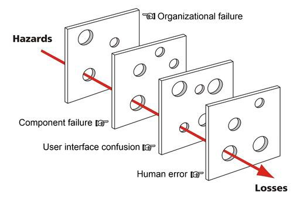

Cybersecurity Management Strategy
=================================

*Ensuring that goals, risks and objectives are assessed*

As an Information Security professional, you are faced with continually changing
vulnerabilities, threats, and regulations. Breaches such as Equifax, OPM, Yahoo,
Home Depot and Target resonate and are used frequently to illustrate the
consequences that may result due to relaxed or missing governance. This list of
notable incidents will continue to grow and update every year. For those in the
business of security, breaches of high profile, and presumably secure
organizations, begs the question “Could this happen to us?” Unfortunately, the
answer is “Yes.”

-   Risk is everywhere. An organization’s mission could make them more of a
    target than another, but no one is immune from risk. How an organization
    deals with their risk however, is a key factor to their survival.
    Organizations must implement an Information Security strategy, a team to
    manage it, and choose a framework to support it. Without a strategic plan,
    knee-jerk reactions and ad-hoc solutions will fail to keep the defense a
    step ahead of threat actors targeting them.

Governance provides a direction for security activities and ensures that
resource and risk management is utilized to support business objectives. When
building a strategy,

one should consider how to define their requirements, a risk posture appropriate
to the organization, and measuring that posture against relevant metrics.

Dante Orlandella and James T. Reason of the University of Manchester proposed
the Swiss cheese model, which is a now widely

recognized model for understanding accident causation. This model can be

applied in risk analysis and risk management for numerous industries; the model
equates the different categories of defense against failures as barriers. These
barriers are like Swiss cheese, meaning that they have holes in them
representing weaknesses. The causation of a failure (or in the case of
information security, an incident) can be traced though holes which have
aligned. The holes allow the trajectory of an incident through existing
barriers. If we consider this while examining information security governance,
the barriers may represent people, processes, and technologies. When weaknesses
are present in each of these barriers, the results can be disastrous. A lack of
proper governance allows for this type of condition to occur. An example of this
is the OPM breach.

*Watch the opening comments by Jason Chaffetz, Chairman of the United States
House Committee on Oversight and Government Reform from 2015 until 2017.*

https://[www.youtube.com/watch?v=xh7sjYZm1v4](http://www.youtube.com/watch?v=xh7sjYZm1v4)
-----------------------------------------------------------------------------------------

Frameworks
==========

NIST Cyber Security Framework
-----------------------------

The Federal Information Security Management Act of 2002 (FISMA) mandates that
all executive or legislative branches within the U.S. federal government (except
those related to national security) apply information security controls to
protect information and information systems. The National Institute of Standards
and Technology (NIST) maintains Special Publication 800-53, among others, to
provide standards and guidelines to assist organizations with implementing
information security controls and governance

The level of detail afforded by implementing a framework based on NIST
publications is considerable, and an organization that is unable, or unwilling
to tailor a framework to their specific industry may use NIST to achieve a level
of detail in implementing risk- based security. The framework lays out a number
of proven cybersecurity practices organized into the following categories:
Identify, Protect, Detect, Respond, and Recover.

https://[www.youtube.com/watch?v=J9ToNuwmyF0](http://www.youtube.com/watch?v=J9ToNuwmyF0)
-----------------------------------------------------------------------------------------

### NIST certifications (no individual certification paths)

-   Federal bodies do not obtain an NIST certification, but rather are certified
    by obtaining and maintaining proof of adherence to a number of other federal
    law/regulations related to FISMA. A key part of the process is the selection
    and implementation of a subset of the controls as put forth by the NIST
    standard and the Federal Information Processing Standards Publication (FIPS)
    200, (Minimum Security Requirements for Federal Information and Information
    Systems.)

ISO 27002 Framework
-------------------

ISO 27002 provides best practice recommendations for an ISMS (Information
Security Management System) standard implemented most often by using ISO 27001.
Focus is

on **what** is managed, as opposed to the **how**. The standard provides
guidelines for organizational information security standards and information
security management practices including the selection, implementation and
management of controls taking into consideration the organization's information
security risk environment(s).

### ISO 27002 certification (no individual certification paths)

-   ISO 27002 (no individual certification paths, 27001 aligns to information
    security management)

Organizations can obtain ISO 27001 certification. Obtaining an ISO 27001
certification may be beneficial to international organizations since it has
worldwide acceptance.

*Other governance frameworks that may offer insights, benefits or processes that
align IT and risk management with business goals include:*

COBIT Framework
---------------

The COBIT Framework (managed by ISACA) is a high-level framework mapping core IT
processes to allow execution of key policies and procedures. The focus for COBIT
is on **what** is managed, as opposed to the **how** it is managed. COBIT allows
for a broad scope that can reach well outside of just information security,
taking into account all IT management processes.

### COBIT aligns with certifications offered through ISACA (4 levels of individual certification)

-   Certified Information Systems Auditor (CISA)

-   Certified Information Security Manager (CISM)

-   Certified in the Governance of Enterprise IT (CGEIT)

-   Certified in Risk and Information Systems Control (CRISC)

ITIL Framework
--------------

ITIL is a set of best practices (managed by the UK) meant to help the management
of IT services throughout their lifecycle. The framework helps organizations to
align IT resources and services to business goals. This framework looks at
**how** resources are managed. ITIL is offered in a series of five core
publications each corresponding to a stage in the lifecycle of IT. While the
framework excels at increasing visibility of process, it is considered a
higher-level standard than ISO 27002 and lacks implementation details in many
cases. It the ISO standards for details in implementation.

### ITIL provides certification through AXELOS (4 levels of individual certification)

-   Foundation

-   Intermediate

-   Expert

-   Master

Roles and Responsibilities
==========================

Organizations may require a number of roles in information security. Depending
on size, some individuals may support multiple roles. We will look at some of
the key roles that play a part in an organizations Information Security (IS)
posture. The role of the Chief Information Officer (CIO) and the Senior Agency
(or Chief) Information Security Officer (SAISO/CISO) are fundamental to an
organizations information security program, however without the support of many
other stakeholders, the program ay still suffer. The Guide for Applying the Risk
Management Framework to Federal Information Systems, NIST Special Publication
800-37 Appendix D, provides in depth information about the responsibilities for
these roles. The publication can be accessed at:
<http://dx.doi.org/10.6028/NIST.SP.800-37r1>.

**The responsibilities of the personnel assigned to IS specific positions must
be well defined, documented, and provided to them**. The roles summarized here
are only a few of those that pertain to IS; note that the responsibilities
provided are a guideline and may vary from one organization to the next. The
publication also outlines various other positions that an agency may have/need
in order to conduct IS operations.

Chief Information Officers (CIOs)
---------------------------------

-   Designating a SAISO/CISO

-   Developing and maintaining an agency-wide IS program

-   Overseeing the creation and maintenance of policies, procedures, and control
    techniques to address all applicable requirements

-   Ensuring compliance with applicable requirements

-   Reporting annually, in coordination with the other senior agency officials,
    to the agency head on the effectiveness of the agency information security
    program, including progress of remedial actions.

Senior Agency (Chief) Information Security Officer (SAISO)/(CISO)
-----------------------------------------------------------------

-   Performing Information Security (IS) duties as the primary duty

-   Heading an office with the mission and resources to assist in ensuring
    agency compliance with IS requirements

-   Periodically assessing risk and magnitude of the harm resulting from
    incidents concerning information and information systems that support
    operations/assets

-   Developing, implementing and maintaining risk-based, cost-effective IS
    policies, procedures, and control techniques to ensure compliance with
    applicable requirements

-   Ensuring that agency personnel, including contractors, receive appropriate
    information security awareness training

-   Training and overseeing personnel with significant responsibilities for
    information security with respect to such responsibilities

-   Periodically testing and evaluating the effectiveness of IS policies,
    procedures, practices, and training

-   Establishing and maintaining a process for planning, implementing,
    evaluating, and documenting remedial action to address any IS deficiencies

-   Developing and implementing procedures for detecting, reporting, and
    responding to security incidents

-   Ensuring preparation and maintenance of plans and procedures to provide
    continuity of operations

-   Supporting the agency CIO in annual reporting to the agency head on the
    effectiveness of the agency information security program, including progress
    of remedial actions.

System Owner/Information Owner
------------------------------

-   System Owners generally pay for and/or rely on systems for a business
    function

-   System Owners maintain operations of assets; operations may include their
    purpose, implementation, and access levels for users

-   Information Owners have the responsibility for protecting the
    information/data stored, processed or used by a system

Users
-----

-   Users need access to data or functions supplied by information system assets

-   Users should be advised by system or information owners on their
    responsibilities; this includes being provided information about policies,
    procedures, guidelines and standards for the organization as well as
    receiving security awareness training

Knowledge, Skills and Abilities (KSA’s)
=======================================

NIST leads the National Initiative for Cybersecurity Education (NICE) working
group and has providing a framework for categorizing cyber related work roles
that relate to the functions defined in the NIST Cybersecurity framework. The
tasks that correspond to the various work roles are assigned and mapped to
Knowledge, Skills, and Attributes (KSAs) required to perform said tasks. More
information about the roles, tasks, and KSAs defined by NICE can be found at:
https://nvlpubs.nist.gov/nistpubs/SpecialPublications/NIST.SP.800-181.pdf

The roles discussed above are related to the basic governance of cybersecurity
within an organization; referencing NIST and NICE frameworks we see the “Govern
and Oversee” has a number of roles that may be assigned depending on an
organization’s purpose or needs. How an organization staffs its departments may
depend on their mission and size, but the following are NICE roles that align to
tasks normally needed by large organizations:

-   **Information Systems Security Manager**: Responsible for the cybersecurity
    of a program, organization, system, or enclave.

-   **Cyber Policy and Strategy Planner**: Develops and maintains cybersecurity
    plans, strategy and policy to support and align with organizational
    cybersecurity initiatives and regulatory compliance

-   **Executive Cyber Leadership**: Executes decision-making authorities and
    establishes vision and direction for an organization's cyber and
    cyber-related resources and/or operations.

The various tasks assigned to these roles may be assessed to determine how an
organization’s existing IS personnel are aligned with the NICE defined roles.
