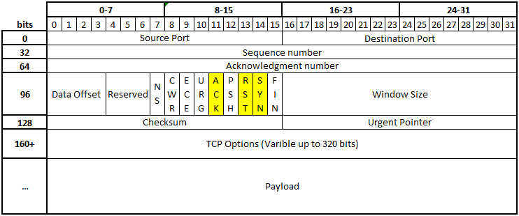
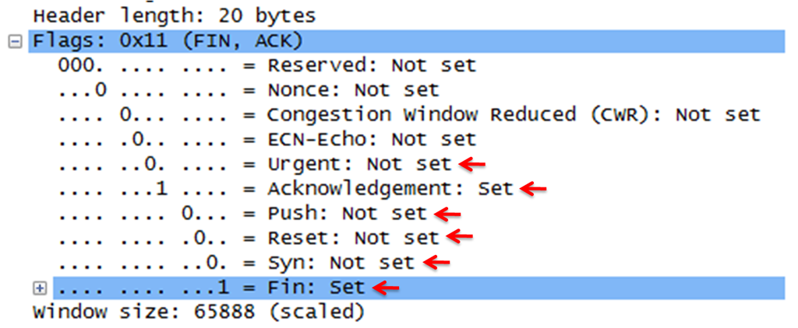

Scanning Deep Dive
==================

Transmission Control Protocol (TCP), User Datagram Protocol (UDP) and Internet
Control Message Protocol (ICMP) are the three major protocols that ride over IP
provide host-to-host connectivity at the Transport Layer of the OSI model (ICMP
is actually a Network layer protocol but is important to Transport layer
protocols operations).

By using an understanding of how TCP and UDP operate, scanning can provide
information about Operating systems, applications running on systems, and
traffic filtering performed. This is critical information to the adversary and
can also be used by defenders when looking for vulnerabilities and assessing
their environments. Scanning is done primarily via TCP because it is a
connection orient protocol; it uses a handshake to establish a connection. The
TCP three-way-handshake is described in the following steps:

-   A client sends a TCP packet to the server with the SYN flag

-   A server responds to the client request with the SYN and ACK flags set.

-   Client completes the connection by sending a packet with the ACK flag set

TCP accepts data from a data stream, splits it into chunks, and adds a TCP
header. This creates a TCP “segment”. A TCP segment only carries the sequence
number of the first byte in the segment. A TCP segment header is where the flags
for the three-way-handshake and other optional flags are contained. It also
contains the source and destination ports, which are important in scanning as
these would be used to target a service operating of the port. An example would
be TCP port 80, which is used for HTTP traffic. A scanning tool may be able to
probe and determine this port as open on the target, which indicates that the
host is running a web server.

**TCP Header**

### TCP Protocol Normal Flag Combinations:

-    SYN, SYN ACK, and ACK are used during the three-way handshake which
    establishes a TCP connection.

-   Except for the initial SYN packet, every packet in a connection must have
    the ACK bit set.

-   FIN ACK and ACK are used during the graceful teardown of an existing
    connection.

-   RST ACK can be used to immediately terminate an existing connection.

-   Packets during the "conversation" portion of the connection (after the
    three-way handshake but before the teardown or termination) contain just an
    ACK by default.

-   Optionally, they may also contain PSH and/or URG.

TCP Protocol Abnormal Flag Combinations:
----------------------------------------

-   SYN FIN is probably the best-known illegal combination. Remember that SYN is
    used to start a connection, while FIN is used to end an existing connection.
    It is nonsensical to perform both actions at the same time. Many scanning
    tools use SYN FIN packets, because many intrusion detection systems did not
    catch these in the past, although most do now. You can safely assume that
    any SYN FIN packets you encounter are malicious.

-   SYN FIN PSH, SYN FIN RST, SYN FIN RST PSH, and other variants on SYN FIN
    also exist. These packets may be used by attackers who are aware that
    intrusion detection systems may be looking for packets with just the SYN and
    FIN bits set, not additional bits set. These are malicious.

-   Packets should never contain just a FIN flag. FIN packets are frequently
    used for port scans, network mapping and other stealth activities.

-   Some packets have absolutely no flags set at all; these are referred to as
    "null" packets. It is illegal to have a packet with no flags set.

Scanning Tools
--------------

There are may popular tools that facilitate automated scanning or manual packet
creation to meet the same intent. Nmap/Zenmap, Netcat, Scapy, and Hping3 are
just a few of the free, open-source tools available. Nmap/Zenmap is one of the
most popular of these, as it is simple, powerful and offers numerous options and
features.

Nmap is the command line only version of the tool, while Zenmap is its
counterpart, offering a GUI interface. It is important before using such tools
to understand what they are doing. This is critical to ensuring that one does
not inadvertently cause problems while using it, and to understand what it may
be used for, both for a defender and for an adversary. When using Nmap within an
organization, host discovery can be performed to identify systems in your LAN.
This is a function that best highlights why using Nmap should be done with root
privileges. Using Nmap with root privileges allows the tool to send raw ARP
packets; these are nearly impossible to block or hide from. Conversely, without
root privilege, Nmap cannot open raw sockets so it attempts to connect to TCP
ports 80 and 443 which is far less reliable. While Nmap can also do ICMP ping
sweeps to identify hosts in other networks (outside the LAN), this is not highly
reliable either since OS and network firewalls often block/drop for security
purposes.

### Common Scanning Methods

-   TCP Connect()Scan (IDS/logs catch this easily!)

-   SYN Scan (half-open)

-   ACK Scan

-   Stealth Scans

-   NULL or FIN Scan (proper response - open-drop; closed-send an RST)

-   UDP Scan (looking for ICMP responses)

Some of these scans can be very easily identified when examining traffic.
Wireshark is a traffic analysis tool that is very useful for this. Note the type
of TCP transmission in the screen capture from Wireshark. The Transport layer
section is expanded to show the flags ACK and FIN set, indicating this is a
graceful termination of a TCP session between hosts.

### Scanning with IPV6

Looking for IPv4 hosts is much easier since their ranges are smaller; an entire
class C range can be swept for all well-known ports in minutes. IPv6 presents a
challenge however since the IP space is some much larger. Scanning every IP for
well-known ports is not feasible. In fact, the IPv6 host address space is
enormous that given the default 64 bit host space, sending 1 probe per second
would take 5 billions years. For this reason, adversaries must identify host
address in order to have any success in scanning. This may be done easily if
organizations use easy to identify IPv6 addresses for important hosts. For
example, the first IP in a range. More information IPv6 Reconnaissance can be
found in RFC 7707.

Operating system and Service Identification
-------------------------------------------

Certain parameters within the TCP protocol definition are left up to the
implementation. Different operating systems, and different versions of the same
operating system, set different defaults for these values. By collecting and
examining these values, one may differentiate among various operating systems,
and implementations of TCP/IP.

Protection against the fingerprint doorway to attack is achieved by limiting the
type and amount of traffic a defensive system responds to. Examples include
blocking *address masks* and *timestamps* from outgoing ICMP control-message
traffic, and blocking ICMP echo replies. A security tool can alert to potential
fingerprinting: it can match another machine as having a fingerprinter
configuration by detecting *its* fingerprint.

Disallowing TCP/IP fingerprinting provides protection from vulnerability
scanners looking to target machines running a certain operating system.
Fingerprinting facilitates attacks. Blocking those ICMP messages is only one
defense required for full protection against attacks.
