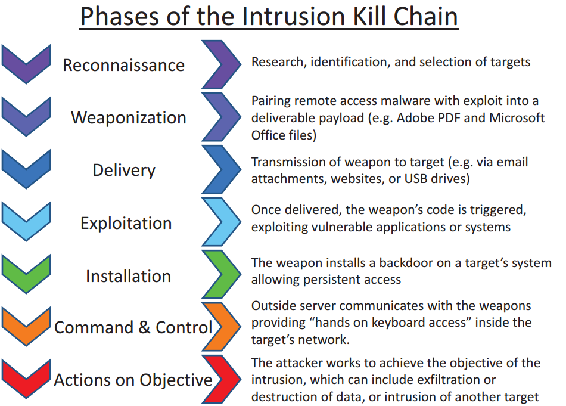

Module 2 Overview
=================

Threats to an organization can be organized at a high level to internal and
external. External threats may be very familiar as they are reported regularly
in the news as more and more organizations suffer large scale
breaches/compromises. Both external and internal threats must be addresses, but
it often requires assuming different perspectives. For discussing external
threats, the Cyber Kill Chain will form the basis of the approach.

Cyber Kill Chain (External Threats)
===================================

Attack phases and countermeasures
---------------------------------

Lockheed-Martin corporation described a new "intrusion kill chain" framework
where they described attacks in phases, which can be disrupted through controls
established at each phase. Since their original work was published in 2011, the
"cyber kill chain" has been trademarked and adopted by organizations throughout
the cybersecurity community to help in understanding attacks and modeling
defenses.

The cyber kill chain reveals that threats must progress through several phases
in movement towards their objective, including:

1.  Reconnaissance: Attacker(s) select target(s), research it, and attempt to
    identify vulnerabilities in the target network to be exploited.

2.  Weaponization: Intruder creates a payload to achieve remote access; usually
    through malware such as a virus or worm, tailored to one or more
    vulnerabilities found during reconnaissance.

3.  Delivery: Attacker transmits weapon to target (e.g., infected website,
    malicious links or attachments in email, USB drive, etc)

4.  Exploitation: Malware triggers, which acts on target network to exploit
    vulnerability.

5.  Installation: Malware installs access point (e.g., "backdoor") usable by
    attacker.

6.  Command and Control: Malware enables attacker to have "hands on the
    keyboard" persistent access to target network.

7.  Actions on Objective: Attacker acts to achieve their goals; may include data
    exfiltration, data destruction, or encryption for ransom (among other
    things).

NIST CSF

NIST CSF

Image source:[<https://en.wikipedia.org/wiki/Kill_chain>]

By investigating these phases, a defender can form courses of action to stop the
attacker from progressing through these phases:

1.  Detect: identify if an attacker is performing reconnaissance.

2.  Deny: prevent information disclosure and unauthorized access.

3.  Disrupt: stop or change outbound traffic (to attacker for C2).

4.  Degrade: counter-attack command and control through elimination of infected
    nodes.

5.  Deceive: interfere with command and control (\*only legal to affect
    internal, organizationally owned assets/software/communications).

6.  Contain: network segmentation to stop spread of access and contain threat
    until eradication.

What to look for
================

An organization must inventory and assess an environment in the same way an
adversary would do reconnaissance, both from an internal and an external
perspective. This includes identifying all of the following:

-   Technologies- *What types of hardware is in use? What vendors? What types of
    software or applications are used?*

-   IP Addresses and Sub-domains- *What are the network IPs, and domains,
    subdomains or hosting providers? What ISPs are used?*

-   People- *Who are the network or system administrators? Who else may have
    elevated privileges or access? How do people connect to the network?*

-   Content of Interest/Importance- *Does the organization collect, process or
    store any sensitive or valuable data? What data may be targeted, and by
    whom?*

-   Vulnerabilities- *Are there known vulnerabilities in the network, systems,
    access, policies, personnel or other aspects of the organization that may be
    highly visible to an attacker (either external or internal)?*

*"All the business of war, and indeed all the business of life, is to endeavor
to find out what you don't know by what you do: that's what I called 'guessing
what was at the other side of the hill"*

\~Duke of Wellington

An Attacker's Perspective
-------------------------

The attacker will be doing an inventory and assessment of an environment while
looking for information and vulnerabilities that may help them in establishing
an avenue of approach. This is the reconnaissance phase. This is an activity
that may be conducted by external or internal threats, so it is important for
defenders to asses their environment(s) from both of these perspectives.

[Continue to Lesson 2: Recon](Recon.md)
