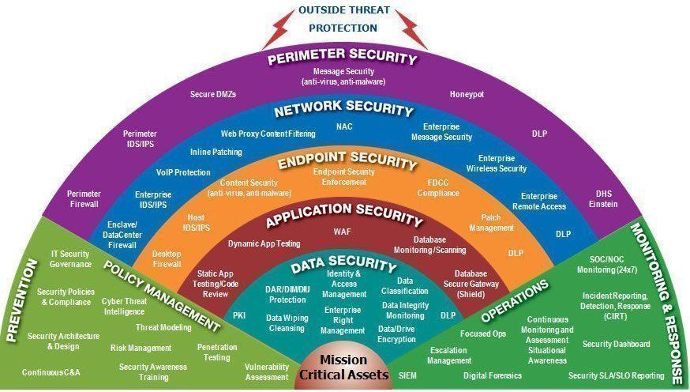

Module 3 Overview
=================

Threats to an organization can be organized at a high level to internal and
external. External threats may be very familiar as they are reported regularly
in the news as more and more organizations suffer large scale
breaches/compromises. Internal threats on the other hand can be far more
dangerous since the treat actor(s) already have access and in some cases
elevated privileges on a network/system. Both external and internal threats must
be addresses, but it often requires assuming different perspectives. For
discussing external threats, the Cyber Kill Chain will form the basis of the
approach.

Defense in Depth (Internal Threats)
===================================

Defense in Depth originated as a military strategy to deliver multiple barriers
between an adversary and their target; these barriers impede the progress of
attackers and slow or stop them from attaining their goals. It also affords the
defense time to monitor progress and develop responses to the incident to
prevent further damages. In cybersecurity, Defense in Depth relates to the
detective and protective measures designed to impede the progress of a attacker
while allowing an organization to respond to the intrusion and reduce or
mitigate impacts of the attack. Defense in Depth employs a holistic approach
against assets, and accounts for interconnections and dependencies. This
approach is well-suited for combating internal threats (e.g. insiders).

DiD

DiD

Image source: [Michael Fisher,
<https://twitter.com/Fisher85M/status/1030976170181976064>]
